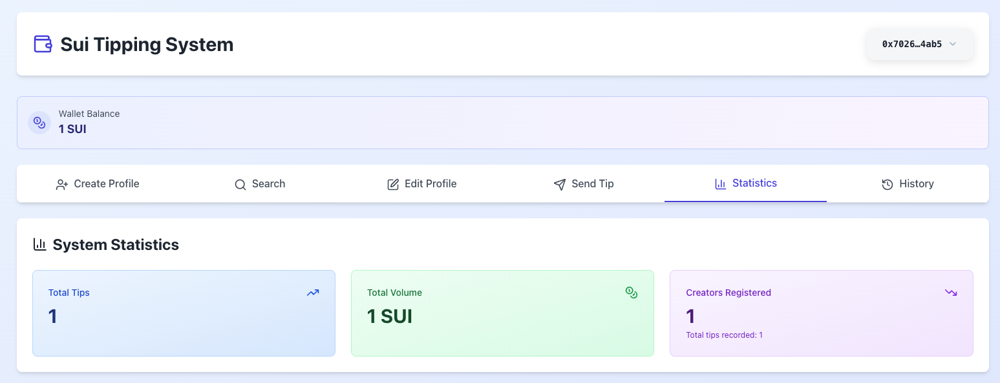

# 🎁 Final Project: Tipping System on Sui Blockchain

This is a complete tipping system project developed in Sui/Move as a final course project, following **market best practices** with modular architecture and comprehensive tests.

## 📋 Description

The Tipping system is a complete decentralized application (dApp) built on Sui blockchain that allows users to:
- **Create personalized profiles** with name, bio, and Twitter handle
- **Search profiles** by Sui address or Twitter handle (@username)
- **Send tips** (in SUI) to other users by address or Twitter handle
- **Edit profiles** to update bio and Twitter handle
- **Track statistics** of tips sent and received
- **View transaction history** of all tips
- **Share profile links** that automatically redirect to the tip sending page
- **View wallet balance** and request test tokens from faucet (devnet)

The system includes a **full-stack implementation** with:
- **Smart contracts** in Move/Sui (backend)
- **React frontend** with TypeScript and Tailwind CSS
- **Twitter handle integration** for easy user discovery
- **Comprehensive test suite** with 26 unit tests

## 🖼️ Screenshot



*The Tipping System interface showing wallet balance, system statistics, and navigation options.*

## 🏗️ Project Structure

The project follows best practices for Move/Sui development, with clear separation of responsibilities:

### Directory Structure

```
projeto_tipping/
├── sources/                 # Smart contract modules
│   ├── errors.move          # Centralized error codes
│   ├── types.move           # Data structures and types
│   ├── events.move          # Event definitions
│   ├── tipping.move         # Main initialization module
│   ├── profile.move         # Profile management
│   ├── tip_operations.move  # Tip sending logic
│   └── system_queries.move  # System queries and lookups
│
├── tests/                   # Test files
│   ├── test_helpers.move
│   ├── profile_tests.move
│   ├── tip_operations_tests.move
│   ├── system_queries_tests.move
│   └── integration_tests.move
│
├── frontend/                # React frontend application
│   ├── src/
│   │   ├── components/      # React components
│   │   │   ├── CreateProfile.tsx
│   │   │   ├── EditProfile.tsx
│   │   │   ├── SearchProfiles.tsx
│   │   │   ├── SendTip.tsx
│   │   │   ├── Statistics.tsx
│   │   │   ├── HistoryView.tsx
│   │   │   └── WalletBalance.tsx
│   │   ├── hooks/           # Custom React hooks
│   │   │   └── useProfile.ts
│   │   ├── lib/             # Utilities and constants
│   │   │   ├── constants.ts
│   │   │   └── utils.ts
│   │   ├── App.tsx          # Main app component
│   │   └── main.tsx         # Entry point
│   ├── package.json
│   └── vite.config.ts
│
└── README.md
```

### Modules

1. **`errors.move`** - Error code centralization
   - Facilitates maintenance and consistency
   - Public functions for accessing error codes

2. **`types.move`** - Data structures and manipulation
   - `UserProfile` - Each user's profile (name, bio, Twitter handle, statistics)
   - `Tip` - Individual tip record
   - `TippingSystem` - Shared system object with Twitter handle registry
   - Twitter handle to address mapping (Table)
   - Creation, access, and modification functions

3. **`events.move`** - Event system
   - `TipSent` - Tip sent event
   - `ProfileCreated` - Profile created event
   - Centralized emission functions

4. **`tipping.move`** - Main module (orchestrator)
   - Only `init` function for initialization
   - Package entry point

5. **`profile.move`** - Profile logic
   - Profile creation with Twitter handle registration
   - Profile updates (bio, Twitter handle)
   - Profile statistics queries
   - User-related functions

6. **`tip_operations.move`** - Tip logic
   - Tip sending (with/without profile, by handle)
   - Tip validations
   - Statistics updates

7. **`system_queries.move`** - System queries
   - Twitter handle to address lookup
   - Global statistics
   - History queries
   - Conversion helper functions (MIST to SUI)

8. **`test_helpers.move`** - Test helper functions
   - Shared functions between test modules
   - System creation for tests

9. **`profile_tests.move`** - Tests for profile module
   - Profile creation tests
   - Statistics query tests
   - Happy and unhappy paths

10. **`tip_operations_tests.move`** - Tests for tip_operations module
    - Tip sending tests
    - Validation and error tests
    - Happy and unhappy paths

11. **`system_queries_tests.move`** - Tests for system_queries module
    - System query tests
    - History tests
    - Conversion tests

12. **`integration_tests.move`** - Integration tests
    - Complete flow tests
    - Multiple users tests

## 🚀 Features

### Smart Contract Functions

**`profile` module:**
- **`create_profile_with_system`** - Creates a new user profile with Twitter handle registration
- **`update_twitter`** - Updates a profile's Twitter handle
- **`update_bio`** - Updates a profile's bio
- **`profile_statistics`** - Returns complete statistics for a profile
- **`profile_name`** - Returns a profile's name
- **`profile_address`** - Returns a profile's address
- **`profile_total_received`** - Returns total received by a profile
- **`profile_total_sent`** - Returns total sent by a profile

**`tip_operations` module:**
- **`send_tip_with_profile_address`** - Sends a tip from a user with profile to another user
- **`send_tip_no_profile`** - Sends a tip from a user without profile
- **`send_tip_to_handle`** - Sends a tip to a user by Twitter handle

**`system_queries` module:**
- **`get_address_by_handle`** - Looks up a Sui address by Twitter handle
- **`total_tips`** - Queries the total number of tips processed
- **`total_volume`** - Queries the total volume in MIST
- **`history_size`** - Returns the history size
- **`get_tip`** - Queries a specific tip from history
- **`mist_to_sui`** - Converts MIST to SUI

### Frontend Features

**Profile Management:**
- ✅ Create profile with name, bio, and Twitter handle
- ✅ Edit existing profile (update bio and Twitter handle)
- ✅ View profile statistics (tips sent/received, total amounts)
- ✅ Share profile link that redirects to tip page

**Search & Discovery:**
- ✅ Search profiles by Sui address (0x...)
- ✅ Search profiles by Twitter handle (@username)
- ✅ View profile details (name, bio, address, Twitter, statistics)
- ✅ Copy addresses to clipboard
- ✅ Direct links to Twitter profiles

**Tipping:**
- ✅ Send tips by Sui address
- ✅ Send tips by Twitter handle (automatically resolves to address)
- ✅ Add optional message with tip
- ✅ View transaction details and explorer links
- ✅ Automatic pre-fill when accessing profile link

**Statistics & History:**
- ✅ View personal statistics (total sent/received, tip counts)
- ✅ View global system statistics (total tips, total volume)
- ✅ View complete transaction history
- ✅ Filter and browse historical tips

**Wallet Integration:**
- ✅ Connect Sui wallet (Sui Wallet, Ethos, etc.)
- ✅ View wallet balance
- ✅ Request test tokens from faucet (devnet)
- ✅ Real-time balance updates

### Events

- **`TipSent`** - Emitted when a tip is sent (includes sender, receiver, amount, message)
- **`ProfileCreated`** - Emitted when a profile is created (includes address, name, Twitter handle)

## 📦 Installation and Execution

### Prerequisites

Make sure you have the Sui CLI installed. If not, follow the course instructions.

### Running Tests

Navigate to the project directory:

```sh
cd sui-project
```

Run the tests:

```sh
sui move test
```

### Frontend Application

The project includes a **modern React frontend** built with:
- ⚛️ **React 18** with TypeScript
- 🎨 **Tailwind CSS** for styling
- 🔗 **@mysten/dapp-kit** for Sui wallet integration
- 📊 **React Query** for data fetching
- 🚀 **Vite** for fast development and building

#### Quick Start (Devnet)

1. **Deploy the contract** to devnet:
   ```sh
   sui client publish --gas-budget 100000000
   ```
   
   Save the package ID and object IDs from the output.

2. **Get your contract IDs** from the deployment:
   ```sh
   # If you know the transaction hash:
   sui client transaction <TRANSACTION_HASH> --json
   
   # Or find your objects:
   sui client objects
   ```
   
   You'll need:
   - **Package ID**: The published package ID
   - **TippingSystem Object ID**: The shared object ID created during initialization

3. **Configure frontend environment variables**:
   ```sh
   cd frontend
   cp env.example .env
   ```
   
   Then edit `.env` and add your contract IDs:
   ```env
   VITE_TIPPING_PACKAGE_ID=0x...  # Your package ID
   VITE_TIPPING_SYSTEM_ID=0x...   # Your TippingSystem object ID
   VITE_DEFAULT_NETWORK=devnet    # or 'mainnet', 'testnet', 'localnet'
   ```

4. **Install dependencies and run the frontend**:
   ```sh
   cd frontend
   npm install
   npm run dev
   ```

The frontend will be available at `http://localhost:5173` and will connect to devnet automatically.

#### Frontend Features Overview

**Navigation Tabs:**
- 📝 **Create Profile** - Create your tipping profile
- 🔍 **Search** - Find profiles by address or Twitter handle
- ✏️ **Edit Profile** - Update your profile information
- 💸 **Send Tip** - Send tips to other users
- 📊 **Statistics** - View personal and global statistics
- 📜 **History** - Browse transaction history

**Key Features:**
- 🔗 **Shareable Profile Links**: Each profile has a unique link (e.g., `?profile=0x...`) that automatically redirects to the Send Tip page with the address pre-filled
- 🐦 **Twitter Integration**: Search and send tips using Twitter handles
- 💰 **Wallet Balance**: View your SUI balance and request test tokens
- 📱 **Responsive Design**: Works on desktop and mobile devices

#### For Localnet Testing

If you want to test on localnet instead:

1. Start a local Sui network:
   ```sh
   sui-test-validator
   ```

2. In another terminal, publish the contract:
   ```sh
   sui client publish --gas-budget 100000000
   ```

3. Update the frontend `.env` file with the localnet package and object IDs.

#### Building for Production

```sh
cd frontend
npm run build
```

The production build will be in the `frontend/dist/` directory.

You should see something like:

```
BUILDING Tipping
Running Move unit tests
[ PASS    ] tipping::profile_tests::test_create_profile_success
[ PASS    ] tipping::profile_tests::test_create_multiple_profiles
[ PASS    ] tipping::profile_tests::test_create_profile_long_name
[ PASS    ] tipping::profile_tests::test_create_profile_name_with_special_chars
[ PASS    ] tipping::profile_tests::test_query_profile_statistics_empty
[ PASS    ] tipping::profile_tests::test_query_profile_name
[ PASS    ] tipping::profile_tests::test_query_profile_address
[ PASS    ] tipping::profile_tests::test_profile_statistics_complete
[ PASS    ] tipping::profile_tests::test_profile_statistics_bidirectional
[ PASS    ] tipping::tip_operations_tests::test_send_tip_success
[ PASS    ] tipping::tip_operations_tests::test_send_multiple_tips
[ PASS    ] tipping::tip_operations_tests::test_send_tip_small_value
[ PASS    ] tipping::tip_operations_tests::test_send_tip_large_value
[ PASS    ] tipping::tip_operations_tests::test_send_tip_empty_message
[ PASS    ] tipping::tip_operations_tests::test_send_tip_long_message
[ PASS    ] tipping::tip_operations_tests::test_tip_zero_value
[ PASS    ] tipping::tip_operations_tests::test_tip_to_self
[ PASS    ] tipping::tip_operations_tests::test_tip_sender_profile_incorrect
[ PASS    ] tipping::system_queries_tests::test_query_empty_system
[ PASS    ] tipping::system_queries_tests::test_query_history
[ PASS    ] tipping::system_queries_tests::test_query_history_multiple_tips
[ PASS    ] tipping::system_queries_tests::test_query_tip_invalid_index
[ PASS    ] tipping::system_queries_tests::test_query_tip_index_out_of_range
[ PASS    ] tipping::system_queries_tests::test_mist_to_sui
[ PASS    ] tipping::system_queries_tests::test_mist_to_sui_large_values
[ PASS    ] tipping::integration_tests::test_complete_flow_multiple_users
Test result: OK. Total tests: 26; passed: 26; failed: 0
```

## 🧪 Unit Tests

The project includes **26 comprehensive unit tests**, organized in separate files by module, following market best practices. Each module has its own corresponding test file:

### Profile Tests (`profile_tests.move` - 9 tests)
**Happy Paths:**
1. **`test_create_profile_success`** - Basic profile creation
2. **`test_create_multiple_profiles`** - Multiple profile creation
3. **`test_create_profile_long_name`** - Profile with long name
4. **`test_create_profile_name_with_special_chars`** - Profile with special characters
5. **`test_query_profile_statistics_empty`** - Initial statistics
6. **`test_query_profile_name`** - Name query
7. **`test_query_profile_address`** - Address query

### Tip Tests (`tip_operations_tests.move` - 9 tests)
**Happy Paths:**
8. **`test_send_tip_success`** - Basic tip sending
9. **`test_send_multiple_tips`** - Multiple transactions
10. **`test_send_tip_small_value`** - Tip with minimum value (1 MIST)
11. **`test_send_tip_large_value`** - Tip with large value (1000 SUI)
12. **`test_send_tip_empty_message`** - Tip without message
13. **`test_send_tip_long_message`** - Tip with extensive message

**Unhappy Paths:**
14. **`test_tip_zero_value`** - Zero value validation (should fail)
15. **`test_tip_to_self`** - Self-tip validation (should fail)
16. **`test_tip_sender_profile_incorrect`** - Non-owned profile validation (should fail)

### System Query Tests (`system_queries_tests.move` - 5 tests)
**Happy Paths:**
17. **`test_query_empty_system`** - System without tips
18. **`test_query_history`** - Basic history query
19. **`test_query_history_multiple_tips`** - History with multiple entries

**Unhappy Paths:**
20. **`test_query_tip_invalid_index`** - Invalid index in empty system
21. **`test_query_tip_index_out_of_range`** - Index out of range

### Statistics Tests (`profile_tests.move` - included in profile tests)
**Happy Paths:**
22. **`test_profile_statistics_complete`** - Complete statistics after tip
23. **`test_profile_statistics_bidirectional`** - Bidirectional tips

### Conversion Tests (`system_queries_tests.move` - 2 tests)
**Happy Paths:**
24. **`test_mist_to_sui`** - Various value conversions
25. **`test_mist_to_sui_large_values`** - Large value conversions

### Integration Tests (`integration_tests.move` - 1 test)
**Happy Path:**
26. **`test_complete_flow_multiple_users`** - Complete flow with 3 users and multiple tips

## 🔧 Concepts Used

This project demonstrates the following Sui/Move concepts:

1. **Modular Architecture**
   - Separation of responsibilities
   - Specialized modules
   - Code reuse

2. **Structs with Abilities**
   - `key` and `store` for blockchain objects
   - `copy` and `drop` for simple types

3. **Shared Objects**
   - `TippingSystem` is a shared object accessible by everyone

4. **Owned Objects**
   - `UserProfile` is an object owned by each user

5. **Token Transfer**
   - Use of `Coin<SUI>` to transfer tokens
   - Conversion between SUI and MIST

6. **Events**
   - Event emission for transaction tracking
   - Centralization in dedicated module

7. **Validations and Errors**
   - Centralized error codes
   - Robust input validations

8. **Unit Tests**
   - Tests with `test_scenario`
   - Success and error case tests
   - Comprehensive coverage

## 📝 Usage Examples

### Smart Contract Usage

#### 1. Create a Profile

```move
use tipping::profile;

// Create profile with Twitter handle
profile::create_profile_with_system(
    &mut system,
    b"My Name",
    b"My bio description",
    b"@myhandle",
    ctx
);
```

#### 2. Send a Tip

```move
use tipping::tip_operations;

// Send tip with profile
tip_operations::send_tip_with_profile_address(
    &mut system,
    &mut sender_profile,
    receiver_address,
    coin,
    b"Thanks for the great work!",
    ctx
);

// Or send tip without profile
tip_operations::send_tip_no_profile(
    &mut system,
    receiver_address,
    coin,
    b"Great content!",
    ctx
);

// Or send tip by Twitter handle
tip_operations::send_tip_to_handle(
    &mut system,
    &mut sender_profile,
    b"@creator",
    coin,
    b"Amazing work!",
    ctx
);
```

#### 3. Query Statistics

```move
use tipping::profile;
use tipping::system_queries;

// Profile statistics
let (address, name, received, sent, tips_received, tips_sent) = 
    profile::profile_statistics(&profile);

// System statistics
let total = system_queries::total_tips(&system);
let volume = system_queries::total_volume(&system);

// Lookup address by Twitter handle
let address_opt = system_queries::get_address_by_handle(&system, b"@creator");
```

### Frontend Usage

#### 1. Create Your Profile
1. Connect your Sui wallet
2. Go to "Create Profile" tab
3. Enter your name, bio, and Twitter handle
4. Click "Create Profile"

#### 2. Search for Users
1. Go to "Search" tab
2. Enter a Sui address (0x...) or Twitter handle (@username)
3. View profile details and copy address

#### 3. Send a Tip
1. Go to "Send Tip" tab
2. Enter receiver address or Twitter handle
3. Enter amount in SUI
4. (Optional) Add a message
5. Click "Send Tip"

#### 4. Share Your Profile
1. Go to "Edit Profile" tab
2. Copy your "Tip Page URL"
3. Share on Twitter or other platforms
4. When someone clicks the link, they'll be redirected to Send Tip page with your address pre-filled

## 🎯 Future Improvements

Some ideas to expand the project:

1. **Reputation System** - Add rating and review system
2. **Tip Categories** - Allow categorizing tips (service, content, donation, etc.)
3. **Recurring Tips** - Subscription/recurring payment system
4. **Advanced Statistics** - Charts, graphs, and detailed analytics
5. **Notifications** - Real-time notification system for new tips
6. **Multi-chain Support** - Support for other chains or Sui testnet/mainnet
7. **Commission System** - Optional platform fee for sustainability
8. **History Filters** - Filter tips by sender/receiver, date, amount
9. **Tip Comments** - Threaded comments on tips
10. **Social Features** - Follow users, tip leaderboards
11. **NFT Badges** - Award NFTs for milestones (100 tips received, etc.)
12. **Mobile App** - Native mobile application

## 📚 Additional Resources

- [Sui Documentation](https://docs.sui.io/)
- [Move Language](https://move-language.github.io/move/)
- [Sui Framework](https://github.com/MystenLabs/sui/tree/main/crates/sui-framework)

## 🎓 Learnings

This project consolidates the following course topics:

- ✅ Variables and primitive types
- ✅ References
- ✅ Conditionals
- ✅ Vectors
- ✅ Strings
- ✅ Structs
- ✅ Abilities
- ✅ Addresses
- ✅ Functions
- ✅ Sui Objects
- ✅ Token transfer
- ✅ Events
- ✅ Tests
- ✅ **Modular Architecture**
- ✅ **Separation of Responsibilities**
- ✅ **Code Best Practices**

## 📄 License

This is an educational project developed as part of the Sui/Move course.

---

**Developed with ❤️ for the Sui/Move course**

**Modular Architecture | Comprehensive Tests | Best Practices**
